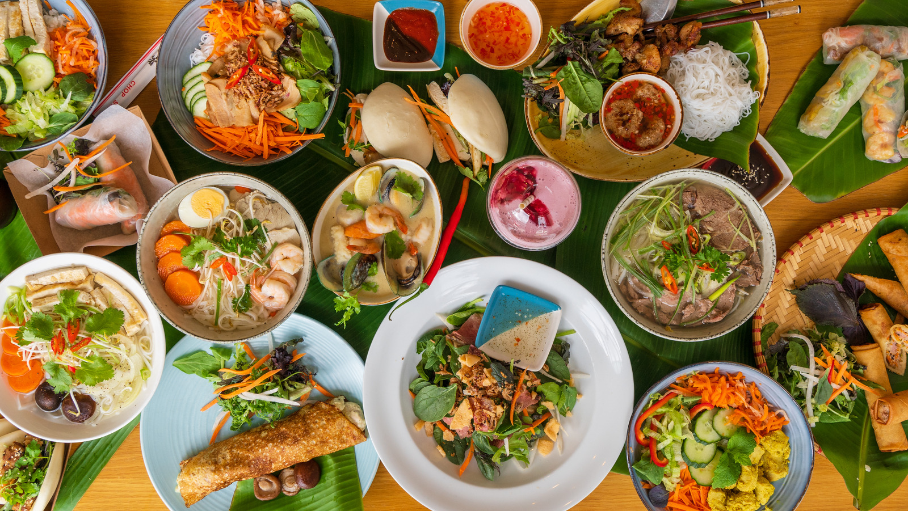

# Nguyen_L_Le_D_HW1
This is our first Github!
# Something about Linh Nguyen

## Hello, my name is Linh Nguyen and my English name is Rose ✿✿✿

**I'm from Hanoi, the capital city of Vietnam. Next month is my 18th birthday. I graduated high school in Vietnam. This year, I'm excited to take the Interactive Media Design course!**

This is the time when I wear the traditional Vietnamese costume called "Ao Dai".

### EDUCATION
**I used to study boarding school in high school. During that time, I was class president and participated in many extracurricular activities with my friends at school. What a memorable time!**

This is my yearbook photo of my class.

### MY FAVORITE
**My favorite hobby is listening to music. Especially, I am a big fan of BlackPink the famous girl group K-pop in the world**

This is Blackpink's picture.

**Furthermore, I am really into cooking. I can cook Asian dishes such as Vietnamese, Korean, Japanese, etc. as well as European dishes**

5 adjectives that describe myself:
- Dynamic
- Vivacious
- Positive
- Friendly
- Adorable

*Thank you for your review!!!*

# Let's introduce Ngoc Dan Le

### All the information about me!

## ABOUT ME

**Hi, I'm Ngoc Dan Le born in 2005 and raised in the largest city in Vietnam, called Ho Chi Minh City. I'm an introvert person and people also included my friends said that I act like a clown, but uhm it's my natural way of communication to others**

*This is me when I was 3 years old*

*This is me again hehehe*

This is me sitting in a "self-study" class in 12th grade but instead of study me and my classmates watched horror movie while waiting for school and parents meeting^^ But don't get me wrong, we still get our works done.

## SCHOOL LIFE

*This is me and my classmates after finished the National Exam*

*This is my Graduation picture*

*This is me and my lovely mom*

I study at Western Australian International School from 1st grade until I graduated highschool in the summer of 2023. It was a fun place to study i guess...but anyways me and my 2 bff have alot of beautiful memories there!

## THE F4 Girls Over Flowers GROUP

*This is me and my friend*

*This is us with the Instagram filter on*

*This is us again*

Mabey you''ll questioning why is it F4 but there's only 3 of us! The 4th member of the group live far away from us so yea.

## UNI AND COLLEGE LIFE

*This is my friend in the University*

*This is me and the gang gang girls in Fanshawe*

After I graduated highschool I attend in Hoa Sen University majored in fashion design, it is a stress but fun major! But now I'm majoring in Interactive Media Design. I hope it would be a great journey!

## MY INTERSTS

# Food

**I love Vietnamese foods and drinks and this is my top 3 favourites**
1. Bun Bo
2. Vietnamese snails
3. Tea

*This is a picture of Vietnamese food*

# Celeb

**I adore listening to music especially Jpop and Kpop**

*This is my favorite Jpop boyband, called Naniwa Danshi*

*This is my favorite Kpop boyband, called NCT*
