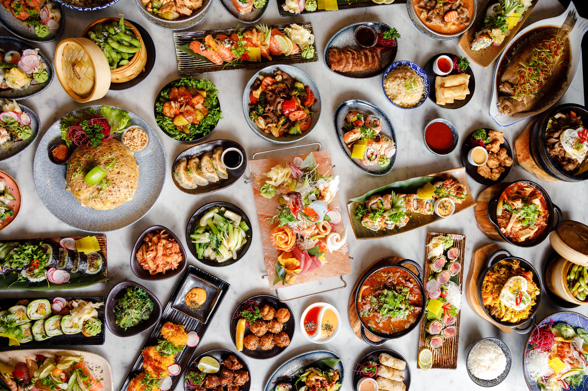

# Nguyen_L_Le_D_HW1
This is our first Github!
# Something about Linh Nguyen

## Hello, my name is Linh Nguyen and my English name is Rose ✿✿✿

**I'm from Hanoi, the capital city of Vietnam. Next month is my 18th birthday. I graduated high school in Vietnam. This year, I'm excited to take the Interactive Media Design course!**

This is the time when I wear the traditional Vietnamese costume called "Ao Dai".

### EDUCATION
**I used to study boarding school in high school. During that time, I was class president and participated in many extracurricular activities with my friends at school. What a memorable time!**

This is my yearbook photo of my class.

### MY FAVORITE
**My favorite hobby is listening to music. Especially, I am a big fan of BlackPink the famous girl group K-pop in the world**

This is Blackpink's picture.

**Furthermore, I am really into cooking. I can cook Asian dishes such as Vietnamese, Korean, Japanese, etc. as well as European dishes**

5 adjectives that describe myself:
- Dynamic
- Vivacious
- Positive
- Friendly
- Adorable

*Thank you for your review!!!*

# Let's introduce Ngoc Dan Le

### All the information about me!

## ABOUT ME

**Hi, I'm Ngoc Dan Le born and raised in the largest city in Vietnam, Ho Chi Minh City. I was born in 2005**

*This is me hehehe*

This is me sitting in a "self-study" class in 12th grade but instead of study me and my classmates watched horror movie while waiting for school and parents meeting^^ But don't get me wrong, we still get our works done.

## SCHOOL LIFE

*This is my Graduate picture*

I study at Western Australian International School from 1st grade until I graduated highschool in the summer of 2023. It was a fun place to study i guess...but anyways me and my 2 bff have alot of beautiful memories there!

## UNI LIFE

*This is my friend in University*

After I graduated highschool I attend in Hoa Sen University majored in fashion design, it is a stress but fun major! I still like it tho!

## MY INTERSTS

# Food

**I love Vietnamese foods and drinks and this is my top 3 favourites**
1. Bun Bo
2. Vietnamese snails
3. Tea

# Celeb

